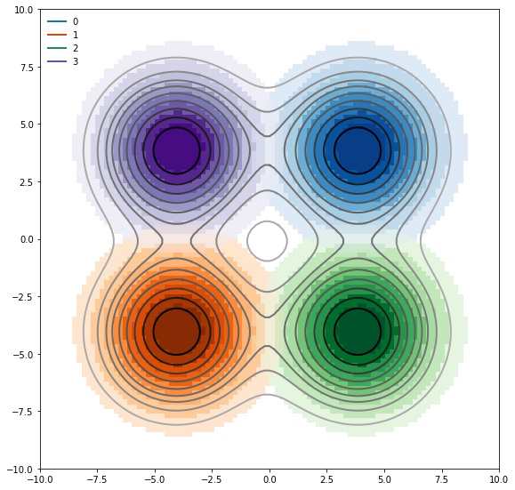
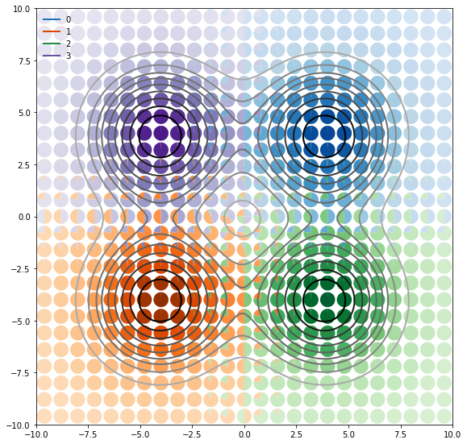
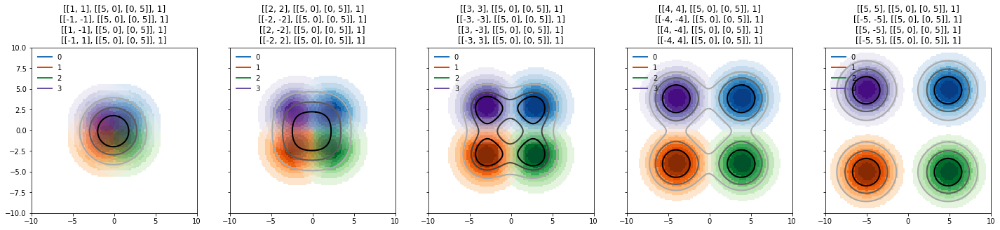

contour-maps-visualisation
==========================
.. image:: https://travis-ci.org/asver12/contour-maps-visualization.svg?branch=master
    :target: https://travis-ci.org/asver12/contour-maps-visualization

.. image:: https://codecov.io/gh/asver12/contour-maps-visualization/branch/master/graph/badge.svg
  :target: https://codecov.io/gh/asver12/contour-maps-visualization

Objective
---------
This library offers a way to visualize multiple 2D-distribution where each distribution has one categorical variable.
It tries in particular to help the viewer to achieve a better understanding of the distributions.
It ships with three types of visualizations:

.. image:: images/crosses.png
    :width: 30%

where each can be used with the others as pleased. There are four kinds of options for the visualization in total. Contours, contour-lines, crosses and pie-charts.

Prerequisites
-------------

Install submodules with:

.. code-block:: console

    git submodule update --init

Make sure python 3.5 or higher and pip3  are installed.
Then install the package with:

.. code-block:: console

    pip3 install .

..  note::

    For Development use:

    .. code-block:: console

        pip3 install -e .

    or if the package is used internal its also possible to install the dependencies with:

    .. code-block:: console

        pip3 install -r requirements.txt

    `Jupyter Interactive Notebook <https://jupyter.org/>`__ should be installed with requirements. If not install it manually

Quickstart
----------

import the Modules:

.. code-block:: python3

    from contour_visualization import example_data, picture_plot

create a list of distributions with:

.. code-block:: python3

    _, _, gaussians, _ = example_data.generate_four_moving_gaussians(size=100)

and get your first visualisation with:

.. code-block:: python3

    picture_plot.plot_images(gaussians, contours=True, contour_lines=True, contour_line_level = 2)

