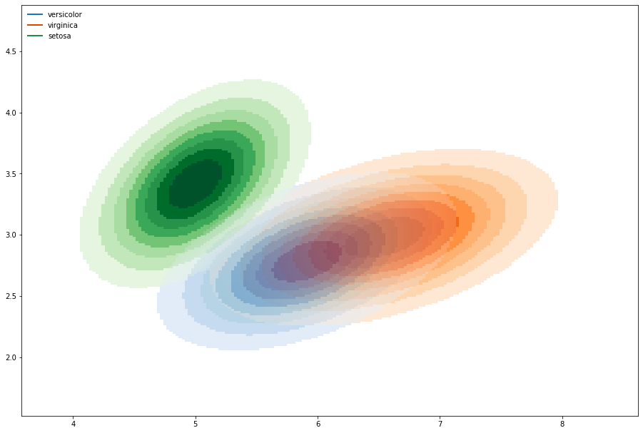

Contour-visualization
=====================

With the this visualization type its possible to visualize the distributions as a two dimensional plot
where the color symbolizes a category and the intensity of lightness and saturation indicates the density value at a given point.
The lightness and saturation are set in relation the total maximum of all distributions mixed in one picture.
At the point where two or more distributions cross the colors are mixed in percent.
The normal mixing procedure puts empathize on the strongest color which results for close density values in an over exaggeration but avoids the creation of new colors.
Its also possible to mix colors fair. For this set use_alpha_sum true. Its also possible to plot the images into any visualization.

To plot an image directly use :meth:`contour_visualization.picture_contours.input_image`.

.. autofunction:: contour_visualization.picture_contours.input_image

