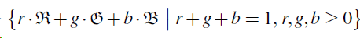
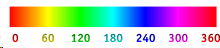
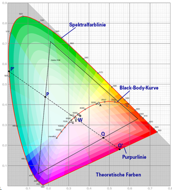

Theorie

# 1 Color spaces

A color space is a specific organization of colors which allows a reproducible representation of color

## 1.1 sRGB

represented by its coordinate vector [r,g,b] where r is red, g is green and b is blue

## 1.2 HSV

* **H**ue (0 = Rot 120 Grün 240 Blau

* **S**aturation (0% Neutralgrau 50% wenig gesättigte Farbe 100% gesättigt)

* **V**alue (0% keine Helligkeit 100% volle Helligkeit)

* HSL has instead of value lightness

## 1.3 XYZ

* Tristimulus-System/CIE-Normsystem

* X -> red, Y-> green , Z blue

* x+y+z = 1

* no similarity function

## 1.4 Lab

Every color in the color space is through its cartesian coordinates defined {L*, a*, b*)

* a* Green and Red -170, 100

* b* Blue and Yellow -100, 150

* L* lightness 0 -100

* similarity function

* rgb -> xyz -> Lab

# 2 Color Groups

* Monochrome (one color)

* Analog (3 colors next to each other)

* Complimentary (colors on the opposite on the color wheel)

* Triadic (Triangle in color wheel)

* ColorBrewer

# 3 Meaning behind colors

Warm:

* Red: Passion, Danger

* Orange: Energy, Creativity

* Yellow: Happy, Active

* Black: Death, Power

Cool

* Green: Nature, Healing

* Blue: Calm, Wisdom

* Purple: Wealth, Ambition

# 4 Contour maps

## 4.1 Contour line

For a function f(x1,x2) = y is a contour line a curve along which the function has a constant value

Curve joins points of equal value

## 4.2 Probability density function

Gives the relative likelihood that the value of the random variable would equal that sample.

The integral of the probability density function specifies the probability of the random variable to fall within a particular range of values

# 5 Color blending operator

* when two opposite hues are mixed, no false colors are generated, and the mixed color is either neutral or with a hint of the front object’s hue

* when more than two hues are mixed a new hue will necessarily are generated -> to minimize  assign opposite colors to the most important objects and neutral colors to the others / avoid two hues which can be created by mixing used hues

* reveal color of interior (back) object -> decreasing the saturation of the exterior (outside) object

* identify overlap regions with depth-peeling algorithm

## 5.1 Porter-Duff-Source-Over

* for two colors A and B

* reduce saturation component of either the front or the back color, depending on which layer contains more important information

* creates false color

* effective on applications in medical volume rendering and parallel coordinates

* Parameter have to be optimized by hand

## 5.2 Chuang et al.

* also based on Opposing-color scheme

* parameter free

* preserves hues of the given color palette, but produces blending results near the gray axis

## 5.3 Urness et al.

* alternative to the standard Porter-Duff blending operators

* preserves the original color palette by displaying the colors of overlapping layers side-by-side instead of mixing them

* color of a pixel is chosen from the colors of the layers covering the pixel following a **weaving pattern**

## 5.4 Kuhne et al.

* data-driven approach

* svm predicts hue-preserving blending

[https://arxiv.org/pdf/1506.01472.pdf](https://arxiv.org/pdf/1506.01472.pdf)

